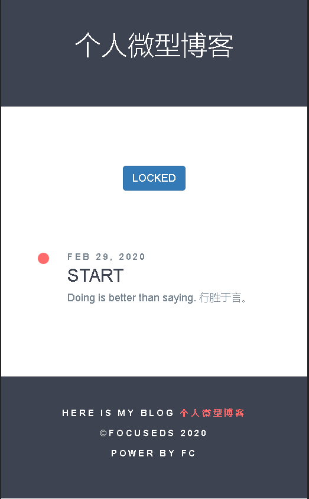
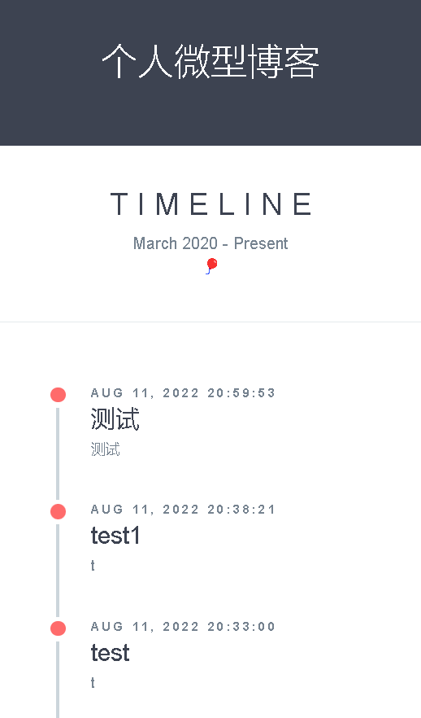

# 基于对象存储和函数计算的微型博客系统

## 关于

本项目前身为个人每日打卡项目，[flask](https://flask.palletsprojects.com/en/2.2.x/)提供web服务，无数据库，数据存储在[阿里云对象存储对象标签](https://help.aliyun.com/document_detail/121939.html)中，托管于云平台函数计算。

每条打卡内容包含四个字段：```标题```、```打卡内容```、```打卡日期```、```打卡时间```和```图片载体```。其中，第一个字段作为图片名存储。后三个字段存储在```载体图片```的```OSS_OBJECT_TAGGING```属性中。对应关系如下。

| 序号  | TAG       | 存储位置 | 备注   |
|-----|-----------|------|------|
| 1   | title     | 文件名  | 打卡标题 |
| 2   | time      | 对象标签 | 打卡日期 |
| 3   | content   | 对象标签 | 打卡内容 |
| 4   | timestamp | 对象标签 | 打卡时间 |

## 功能描述

## 使用

### 创建OSS Bucket

1. 创建bucket，并保存endpoint。详情请见：[创建存储空间](https://help.aliyun.com/document_detail/31885.html)；
2. 创建子账户，授权OSS访问权限后保存AccessKey。[创建子账户](https://help.aliyun.com/document_detail/93720.htm)；
3. 在OSS中创建保存图片的文件夹```prefix/```；

### 完善配置文件

1. 完成上一步后，将阿里云子账户访问相关配置、BUCKET名称、ENDPOINT位置和目录前缀等信息配置到```config.py```中；
2. 设置访问密码，默认为：```welcome```。

### 部署工具

1. 通过Funcraft实现资源管理，但是Funcraft后期不再维护，推荐使用Serverless Devs管理进行管理。详情请见：[什么是Serverless Devs](https://help.aliyun.com/document_detail/195473.html)。
2. 对flask中提供路由对应配置到函数计算配置中。

[//]: # (<p align="center">)

[//]: # ()

[//]: # ()

[//]: # (</p>)

## 参考链接

1. [阿里云对象存储OSS](https://www.aliyun.com/product/oss)
2. [阿里云对象存储对象标签](https://help.aliyun.com/document_detail/121939.html)
3. [阿里云函数计算FC](https://help.aliyun.com/document_detail/52895.html)